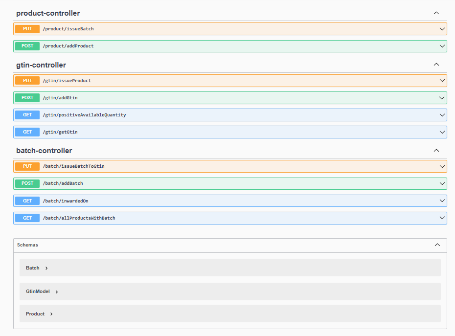

# Product Gtin

The project is designed to manage GTIN-based batch data, providing APIs for creating records, querying by GTINs, and retrieving batches with conditions on availability and recency. It ensures efficient data handling and targeted queries for inventory management.



**Clone the Repository:**
   ```bash
   git clone https://github.com/ansariwajid9999/Gtin_Product.git

Update application.properties:

spring.application.name=****
spring.datasource.url=jdbc:mysql://localhost:3306/****?createTableIfNotExists=true
spring.datasource.username=****
spring.datasource.password=****
spring.jpa.hibernate.ddl-auto=update

Run the Project:

Run the Spring Boot application from IntelliJ IDEA.
Use Postman to test the backend by sending requests to the API endpoints.

